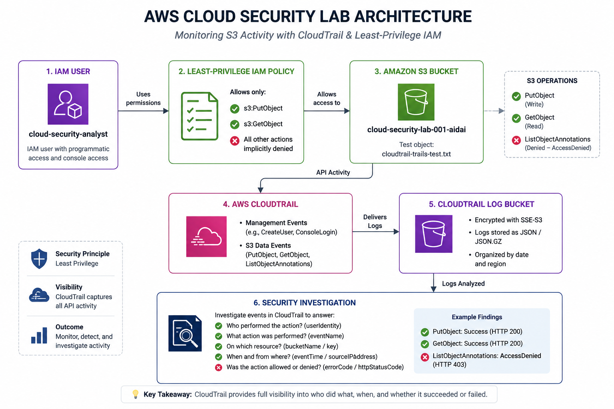
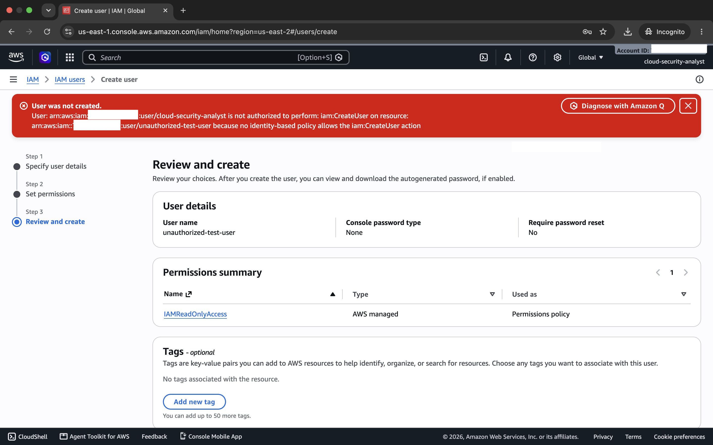
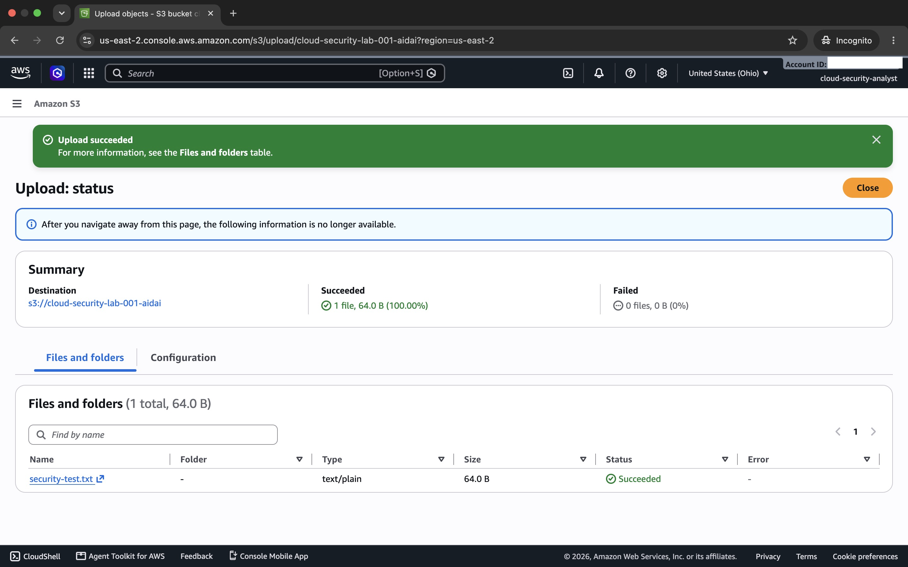
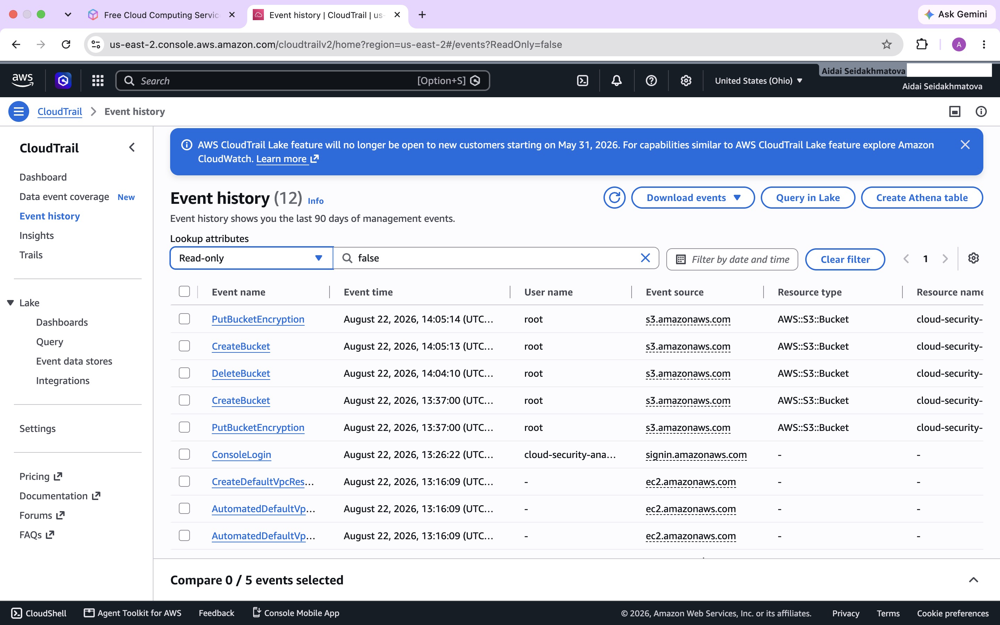
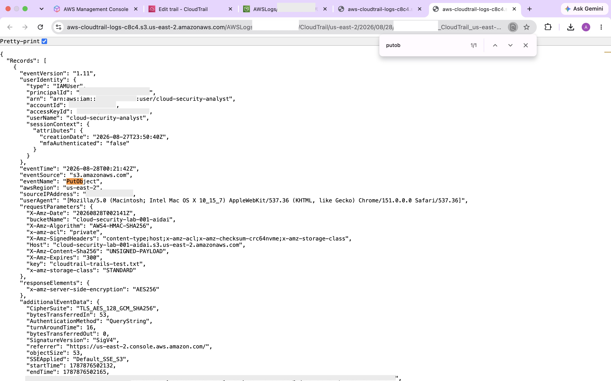
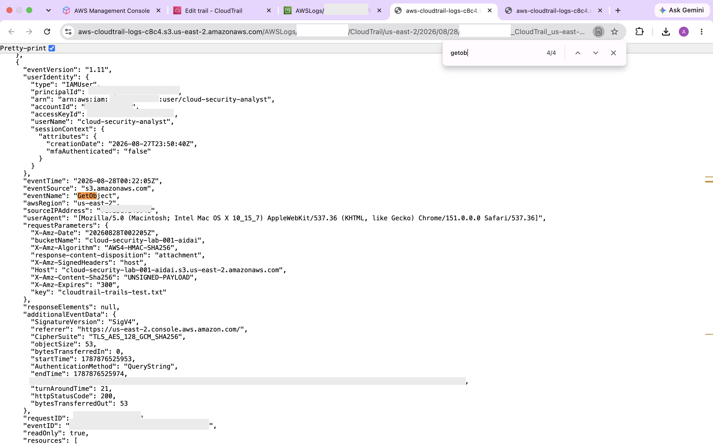
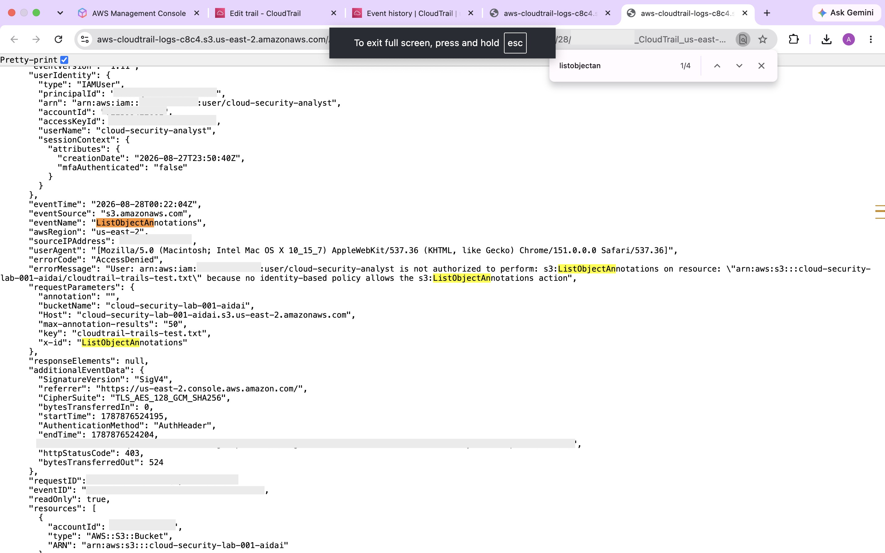

# AWS Cloud Security & CloudTrail Investigation Lab

## Overview

This project is a hands-on AWS cloud security lab focused on **IAM least privilege, Amazon S3 security, AWS CloudTrail logging, and cloud security investigation**.

I created a restricted IAM user, implemented a custom least-privilege S3 policy, secured an S3 bucket, configured CloudTrail to capture S3 object-level data events, and investigated both successful and denied API activity.

The goal of this project was to practice how a cloud security or SOC analyst can use **access controls and audit logs together** to understand who performed an action, what resource was affected, and whether the action was allowed or denied.

---

## Architecture



### Lab Flow

`Restricted IAM User → Least-Privilege Policy → Amazon S3 → AWS CloudTrail → CloudTrail Log Bucket → Security Investigation`

### AWS Services Used

- **AWS IAM** — identity and access management
- **Amazon S3** — secured test storage
- **AWS CloudTrail** — API activity logging
- **IAM Policies** — least-privilege authorization
- **Amazon S3 Log Bucket** — storage for CloudTrail JSON logs

---

# 1. IAM & Least-Privilege Access

I created a restricted IAM user:

`cloud-security-analyst`

The identity was used as a test security analyst account rather than performing the lab entirely with the AWS root user.

The IAM user had **console access and no access keys**, avoiding unnecessary long-term programmatic credentials.

I attached `IAMReadOnlyAccess` and created a custom S3 policy that granted only the S3 permissions needed for the lab.

### Custom S3 Permissions

The policy allowed:

```text
s3:ListAllMyBuckets
s3:ListBucket
s3:GetBucketLocation
s3:GetObject
s3:PutObject
s3:DeleteObject
```

Object permissions were restricted to the designated lab bucket rather than granting broad S3 administrative access.

---

## Least-Privilege Validation

To test whether the access boundary worked, I attempted to create another IAM user while authenticated as `cloud-security-analyst`.

AWS denied the operation because the identity did not have permission to perform:

`iam:CreateUser`



This demonstrated that the account could perform its intended lab functions without receiving unnecessary IAM administrative privileges.

---

# 2. Amazon S3 Security

I created a dedicated S3 bucket for controlled security testing.

The bucket was configured with security controls including:

- **Block Public Access enabled**
- **ACLs disabled**
- **Bucket Owner Enforced**
- **Server-side encryption with SSE-S3**
- **Restricted IAM access**
- **No public object access**

Initially, insufficient permissions prevented the restricted IAM user from performing the required S3 operations.

I reviewed the authorization problem and updated the custom policy with only the permissions necessary for the lab.

The IAM user was then able to successfully upload the test object.



This helped demonstrate the distinction between:

**Authentication** — verifying the identity of a user.

**Authorization** — determining which actions that authenticated identity is permitted to perform.

---

# 3. AWS CloudTrail Logging

I configured an AWS CloudTrail trail to record AWS API activity.

CloudTrail was configured to capture:

### Management Events

Examples include:

- Console authentication activity
- Bucket configuration activity
- AWS resource management operations

### S3 Data Events

I configured an **advanced event selector** specifically for object-level activity in the lab S3 bucket.

This provided visibility into operations such as:

```text
PutObject
GetObject
ListObjectAnnotations
```

The selector was scoped to the lab bucket rather than unnecessarily collecting S3 data events for every bucket in the account.

CloudTrail log files were delivered to a separate S3 logging bucket in compressed JSON format:

```text
.json.gz
```

---

## CloudTrail Event History

I used CloudTrail Event History to examine management activity generated in the AWS environment.



An important lesson from this phase was understanding the difference between **CloudTrail management events and S3 data events**.

CloudTrail Event History provides management-event visibility, while the configured trail and S3 data-event selector were required to capture object-level operations such as `PutObject` and `GetObject`.

---

# 4. CloudTrail Investigation — PutObject

I generated controlled S3 activity by uploading a test object and then located the corresponding CloudTrail record.

The event was identified as:

```text
eventSource: s3.amazonaws.com
eventName: PutObject
```



During the investigation, I examined fields including:

- `eventTime`
- `eventSource`
- `eventName`
- `userIdentity`
- `userName`
- `sourceIPAddress`
- `awsRegion`
- `bucketName`
- object `key`
- request parameters
- encryption information
- authentication/signature information

The event showed that the restricted IAM identity successfully performed an authorized write operation against the monitored S3 bucket.

### Finding

**PutObject → Allowed**

This behavior matched the permissions explicitly granted by the custom IAM policy.

---

# 5. CloudTrail Investigation — GetObject

I then downloaded the test object to generate a read operation.

The corresponding CloudTrail event showed:

```text
eventSource: s3.amazonaws.com
eventName: GetObject
httpStatusCode: 200
readOnly: true
```



The event allowed me to determine:

- **Who** accessed the object
- **What** API operation occurred
- **Which** S3 object was accessed
- **When** the activity occurred
- **Where** the request originated
- **Whether** the request succeeded

### Finding

**GetObject → Allowed / HTTP 200**

The successful operation was expected because `s3:GetObject` was explicitly granted to the IAM identity.

---

# 6. Investigating AccessDenied Activity

CloudTrail also captured an attempted S3 operation:

```text
ListObjectAnnotations
```

The IAM identity did not have permission for this action.

CloudTrail recorded:

```text
errorCode: AccessDenied
httpStatusCode: 403
```



The error message explained that no identity-based policy allowed the requested `s3:ListObjectAnnotations` action.

Instead of granting another permission simply to eliminate the error, I verified that this operation was **not required for the intended functionality of the lab**.

### Finding

**ListObjectAnnotations → AccessDenied / HTTP 403**

This demonstrated that the least-privilege boundary was functioning as intended.

> **An AccessDenied event does not automatically indicate a broken configuration. In a least-privilege environment, it can provide evidence that an access-control boundary is working correctly.**

---

# Investigation Summary

| Activity | Result | Interpretation |
|---|---|---|
| `PutObject` | Allowed | Authorized S3 write |
| `GetObject` | HTTP 200 | Authorized S3 read |
| `ListObjectAnnotations` | AccessDenied / HTTP 403 | Operation outside permitted S3 access |
| `CreateUser` | AccessDenied | IAM administrative privilege restricted |

The lab demonstrated the relationship between **preventive security controls and detective security controls**:

- **IAM** controlled what the identity was permitted to do.
- **CloudTrail** provided visibility into the API activity that occurred.

---

# Security Concepts Practiced

Through this project, I gained hands-on experience with:

- AWS Identity and Access Management (IAM)
- Principle of least privilege
- Identity-based IAM policies
- IAM authorization troubleshooting
- Amazon S3 security
- S3 Block Public Access
- S3 server-side encryption
- AWS CloudTrail
- CloudTrail management events
- CloudTrail S3 data events
- Advanced event selectors
- JSON security log analysis
- AWS API activity investigation
- Successful vs. denied requests
- HTTP `200` vs. HTTP `403`
- Security monitoring and audit trails
- Cloud security troubleshooting
- Cloud cost awareness

---

# Key Takeaways

### 1. Least privilege should be tested

Creating a restrictive policy is not enough by itself. I validated the access boundary by attempting operations both inside and outside the identity's intended permissions.

### 2. Denied activity is useful security telemetry

The `AccessDenied` event helped demonstrate which operation was attempted, which identity initiated it, which resource was involved, and why AWS rejected the request.

### 3. Management events and data events serve different purposes

CloudTrail Event History was useful for management activity, while S3 object-level activity required CloudTrail data-event logging.

### 4. Logs answer investigation questions

CloudTrail records allowed me to investigate:

```text
WHO performed the action?
WHAT API action occurred?
WHICH resource was affected?
WHEN did it happen?
WHERE did the request originate?
WAS the operation successful or denied?
```

### 5. Security controls work together

IAM provided **access control**, while CloudTrail provided **visibility and accountability**.

Together, they created a basic cloud security monitoring workflow.

---

# Security & Privacy

All screenshots included in this repository were reviewed and redacted before publication.

Account-specific and potentially sensitive identifiers were removed where appropriate, including:

- AWS account IDs
- Access key identifiers
- Principal identifiers
- Source IP addresses
- Request IDs
- Event IDs
- Account-specific ARN components
- Other unique AWS request identifiers

No passwords, secret access keys, session tokens, or authentication credentials are included in this repository.

---

# Cleanup & Cost Awareness

S3 object-level CloudTrail data events can generate additional charges.

After completing the required investigation and collecting the evidence for this project, the S3 data-event configuration used for testing was removed to prevent unnecessary continued data-event logging.

No long-term access keys were created for the `cloud-security-analyst` IAM user.

---

# Skills Demonstrated

`AWS` `IAM` `Amazon S3` `AWS CloudTrail` `Cloud Security` `Least Privilege` `Log Analysis` `Incident Investigation` `Access Control` `JSON` `Security Monitoring`

---

## Project Purpose

This lab was created as an independent hands-on cybersecurity project to strengthen practical skills in **cloud security monitoring, IAM access control, and AWS log investigation**.
